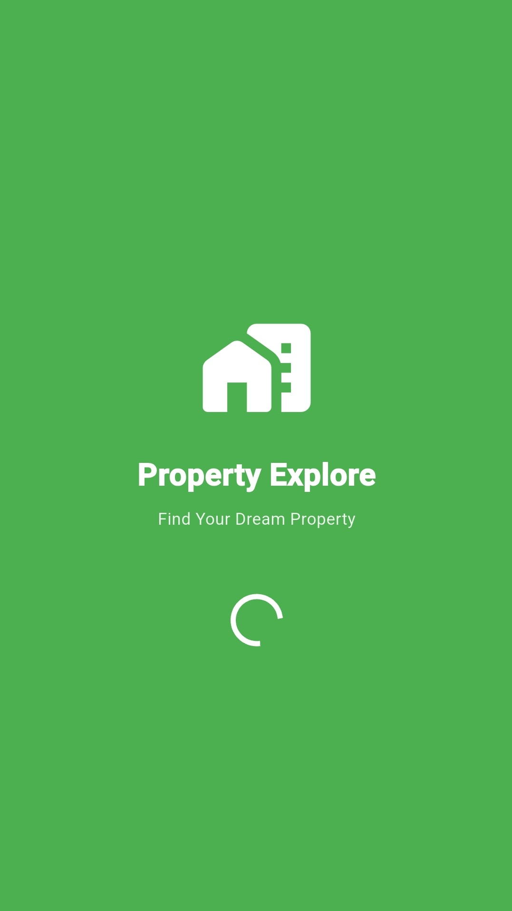
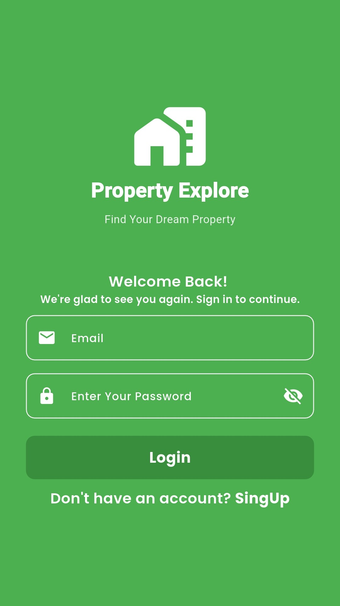
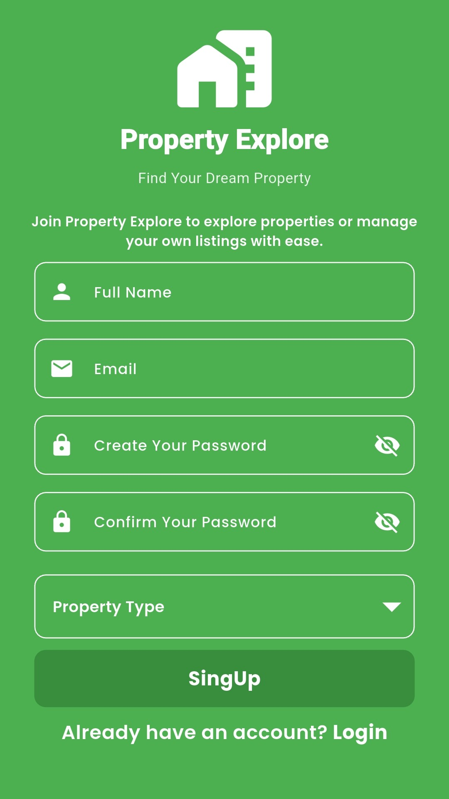
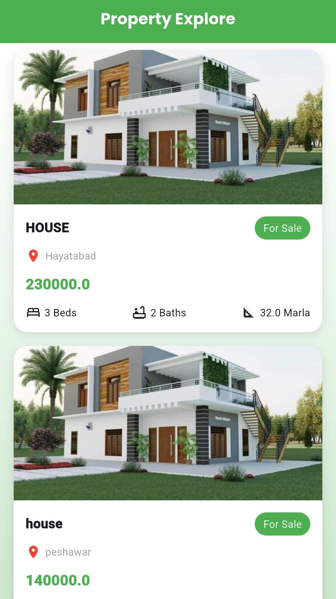
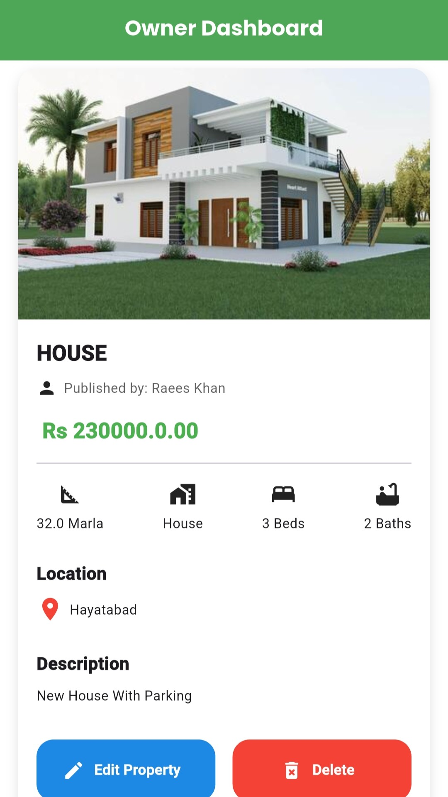
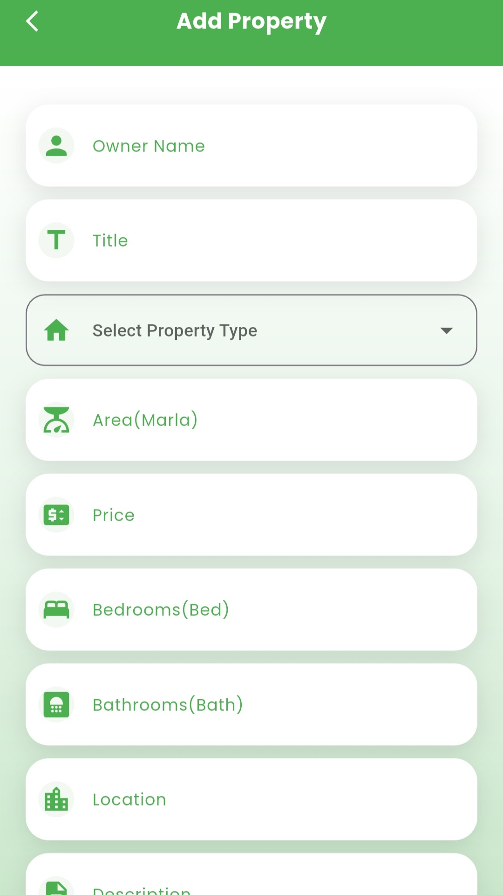
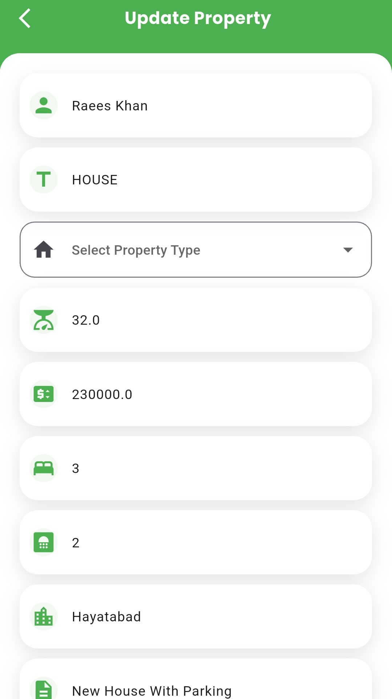
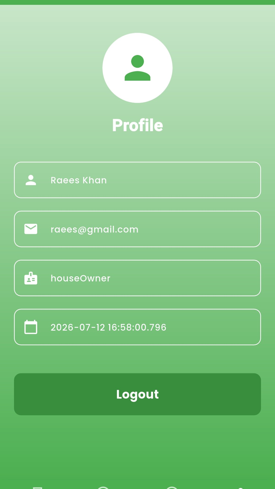

# 🏡 Property Explore

<p align="center">
  
</p>

<h1 align="center">Property Explore</h1>

<p align="center">
A modern real estate application built with <b>Flutter</b>, <b>Provider</b>, and <b>Firebase</b>.
</p>

<p align="center">


</p>

<p align="center">
<b>🏠 House Owner • 👤 Customer • 🔥 Firebase • 📱 Flutter</b>
</p>

---

# 📸 Application Preview

<p align="center">




</p>

<p align="center">




</p>

---

# ✨ Features

## 🔐 Authentication

- Login
- Sign Up
- Forgot Password
- Firebase Authentication
- Role-Based Authentication

## 🏠 House Owner

- Add Property
- Update Property
- Delete Property
- Manage My Properties
- Owner Dashboard

## 👤 Customer

- Browse Properties
- Explore Listings
- Responsive Property Cards

## 🔥 Firebase

- Firebase Authentication
- Cloud Firestore
- Real-Time Data Fetching

---

# 🛠 Tech Stack

- Flutter
- Dart
- Provider
- Firebase Authentication
- Cloud Firestore
- Google Fonts

---

# 🏗 Architecture

- Feature-Based Architecture
- Provider State Management
- Service Layer
- Model Layer
- Reusable Widgets
- Clean & Scalable Folder Structure

---

# 📂 Project Structure

```text
lib
│
├── core
│   ├── widgets
│   └── utils
│
├── feature
│   ├── auth
│   ├── properties
│   │   ├── Owner
│   │   └── Customer
│   │
│   └── ...
│
└── main.dart
```

---

# 🚀 MVP Version 1

- ✅ Firebase Authentication
- ✅ Role-Based Login
- ✅ Property CRUD
- ✅ Owner Dashboard
- ✅ Customer Property Listing
- ✅ Provider State Management
- ✅ Firestore Integration

---

# 🚀 Version 2 Roadmap

- 📸 Multiple Property Images (Cloudinary)
- 🏠 Property Details Screen
- 🔍 Search Properties
- 🎯 Advanced Filters
- ❤️ Favorite Properties
- 📍 Google Maps Integration
- 📞 Contact Property Owner
- 🔔 Push Notifications
- 📄 Pagination
- 🔐 Firebase Security Rules
- 🗂 Repository Pattern
- ✨ UI/UX Improvements

---

# 🚀 Getting Started

```bash
git clone https://github.com/raeeskhan371/propertie_explore.git
```

```bash
flutter pub get
```

```bash
flutter run
```

---

# 👨‍💻 Developer

### Raees Khan

Flutter Developer

GitHub: **https://github.com/raeeskhan371**

---

<p align="center">

⭐ If you like this project, please consider giving it a star!

</p>
